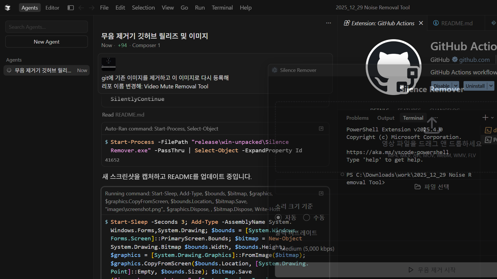

# Video Mute Removal Tool / 비디오 무음 제거 도구

A Windows desktop application that automatically removes silent segments from video files.  
비디오 파일에서 무음 구간을 자동으로 제거하는 Windows 데스크톱 애플리케이션입니다.

## Features / 주요 기능

- 🎬 **Multiple Video Format Support / 다양한 비디오 형식 지원**: MP4, MKV, AVI, MOV, WebM, WMV, FLV
- 🔊 **Auto/Manual Sound Volume Threshold / 자동/수동 소리 크기 기준 설정**: Automatic detection or manual configuration
- ⚙️ **Output Bitrate Control / 출력 비트레이트 조절**: Low, Medium, High quality options
- 🚀 **Easy to Use / 간편한 사용법**: Simple drag-and-drop or file selection interface

## Download & Installation / 다운로드 및 설치

### For Windows Users / Windows 사용자

1. Download the latest version from the [Releases page](https://github.com/kyungju-lee/Video-Mute-Removal-Tool/releases)
   [릴리즈 페이지](https://github.com/kyungju-lee/Video-Mute-Removal-Tool/releases)에서 최신 버전을 다운로드하세요.

2. Extract the `release/win-unpacked` folder
   `release/win-unpacked` 폴더를 압축 해제하세요.

3. Run `Silence Remover.exe`
   `Silence Remover.exe` 파일을 실행하세요.

## How to Use / 사용 방법

1. **Select Video File / 비디오 파일 선택**
   - Drag and drop video files into the upload area, or
   - 드래그 앤 드롭으로 비디오 파일을 업로드하거나
   - Click the "파일 선택" (File Select) button to choose a file
   - "파일 선택" 버튼을 클릭하여 파일을 선택하세요.

2. **Adjust Settings / 설정 조정**
   - **Sound Volume Standard / 소리 크기 기준**: Choose Auto or Manual mode
   - **소리 크기 기준**: 자동 또는 수동 모드 선택
   - **Output Bitrate / 출력 비트레이트**: Select desired quality (Low/Medium/High)
   - **출력 비트레이트**: 원하는 품질 선택 (Low/Medium/High)

3. **Start Silence Removal / 무음 제거 시작**
   - Click the "무음 제거 시작" (Start Silence Removal) button to begin processing
   - "무음 제거 시작" 버튼을 클릭하여 처리를 시작하세요.

4. **Check Progress Status / 진행 상태 확인**
   - Monitor the processing status in the progress area at the bottom
   - 하단의 진행 상태 영역에서 처리 상태를 확인할 수 있습니다.

## System Requirements / 시스템 요구사항

- Windows 10 or higher / Windows 10 이상
- Python 3.x (included in the app / 앱에 포함되어 있음)
- FFmpeg (included in the app / 앱에 포함되어 있음)

## Supported Formats / 지원 형식

- MP4
- MKV
- AVI
- MOV
- WebM
- WMV
- FLV

## Screenshot / 스크린샷

## License / 라이선스

This project is licensed under the MIT License.  
이 프로젝트는 MIT 라이선스를 따릅니다.

## Contributing / 기여

Bug reports and feature suggestions are welcome via the [Issues](https://github.com/kyungju-lee/Video-Mute-Removal-Tool/issues) page.  
버그 리포트나 기능 제안은 [Issues](https://github.com/kyungju-lee/Video-Mute-Removal-Tool/issues) 페이지를 통해 제출해주세요.
